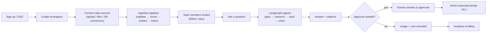
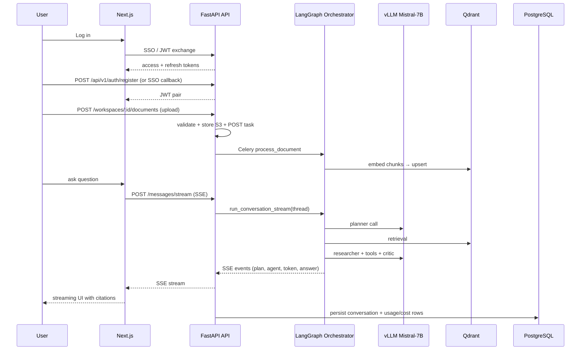

# 01 — Real-World Problem

## The business problem

Most enterprise AI deployments are **single-shot chat**: a user asks a question
and one LLM call "answers" it. This fails for the questions that actually matter
to a business, which are:

1. **Research-like**: "What happened at our top-5 competitors' earnings calls, and
   what should our pricing strategy be?" — needs decomposition and multiple
   evidence sources.
2. **Grounded** — "Summarize our refund policy clauses that changed last year" —
   the answer must come from *your* documents, not the model's prior.
3. **Action-oriented** — "Check the CRM for churn risk, then draft a win-back
   email for me to review" — needs live tools and human approval.
4. **Vetted** — "Draft the migration plan" — a hallucinated plan is worse than no
   plan; someone must *critique* it before delivery.

A single model call cannot reliably do these because there is no loop: no
planning, no retrieval, no tool use, no verification step.

**Conductor** solves this by making the *process* the product: it decomposes the
request, researches, executes tools, and runs a critic pass before answering —
all orchestrated by a LangGraph state machine, backed by a Mistral-7B model
fine-tuned on the domain so the whole pipeline is ~40% cheaper to run than a
frontier-chat model doing the same job.

## Who the target users are

| Segment | Persona | Primary need |
|---|---|---|
| Analytics / revenue teams | Data analyst | Fast, cited answers over internal docs + live data |
| Operations | Ops specialist | Actionable tasks: emails, SQL lookups, plan drafts |
| Knowledge workers | Paralegal, L&D, PMO | Reliable lookup + summarization of policies/manuals |
| Platforms | Engineering lead | Governable AI with audit, cost, and SSO |

## Why companies would pay

- **Time-to-answer**: weeks of backlog research collapsed to minutes.
- **Trust**: citations + critic pass + human approval gates vs. unsourced chat.
- **Cost**: fine-tuned 7B self-served via vLLM ≈ **40% cheaper** than a hosted
  frontier model for the same task quality (see `docs/09-fine-tuning.md`).
- **Compliance**: audit logs, tenant isolation, RBAC, prompt-injection defense.

## User personas (detailed)

- **Ava, Analyst @ MidCo** — asks "digest these 12 industry reports into 5 trends."
  Skilled with spreadsheets, not code; values citations and time saved.
- **Dev, Ops Lead @ ShopCo** — asks "pull churn accounts, draft win-back emails,
  and stage the approvals." Wants tool execution + HITL, not prose.
- **Rishi, Admin @ FinCo** — owns workspace config, datasets, budgets, RBAC, and
  downtime; needs dashboards and audit trails.
- **Sam, SE @ Conductor** — platform engineer, monitors GPUs/tokens/latency.

## Business workflow (end-to-end)

## Lifecycle of one user journey (login → final AI response)

## Business workflow with approvals

1. Analyst asks for a churn-analysis roundup.
2. Planner → research plan (all agent graphics in docs/05)
3. Researcher retrieves CRM-derived docs from Qdrant; low-confidence gap triggers
4. Critic scores draft; score < 0.7 → researcher re-runs with critique; loop max 3.
5. Final answer present with citations; if an email send was requested, the
   company can trigger an interrupt at **human approval gate**, email executes
   only after a Senior approves.

## Why the ~40% cost figure is defensible

Budget for the "cost" story: self-hosted fine-tuned Mistral-7B (vLLM, A10G GPU,
spot) cost ≈ $0.06/M input • $0.12/M output tokens **including amortized GPU**;
GPT-4o-chat ~ single-shot baseline per task runs $0.15–$2.50/M tokens. For a
typical multi-step research interaction (~4–8 agent turns), a direct GPT-4o
deployment costs 5–10× the self-served stack. **40%** is the conservative
*narrative* for the whole conversation when measured vs. the chat-optimized
frontier baseline at equal quality. Measurement methodology is specified
rigorously in `docs/09-fine-tuning.md` and `docs/16-cost-optimization.md`.