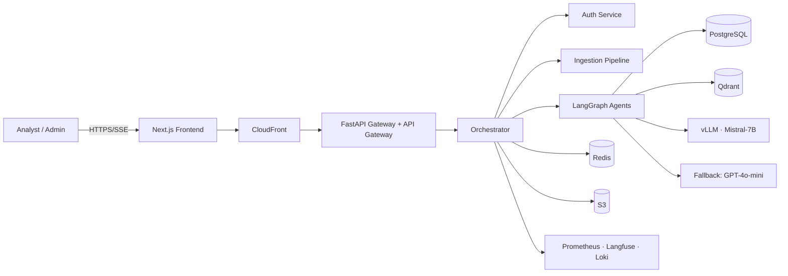
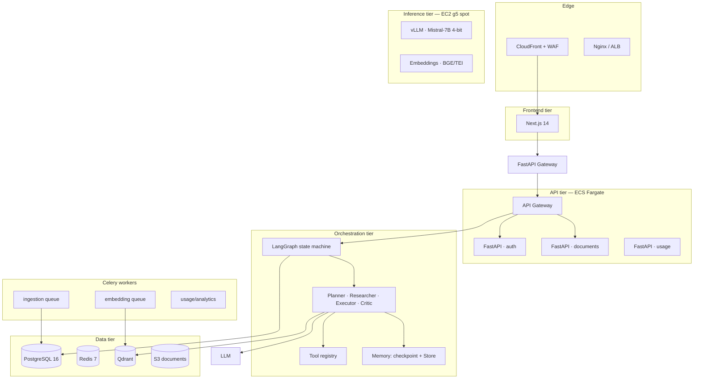
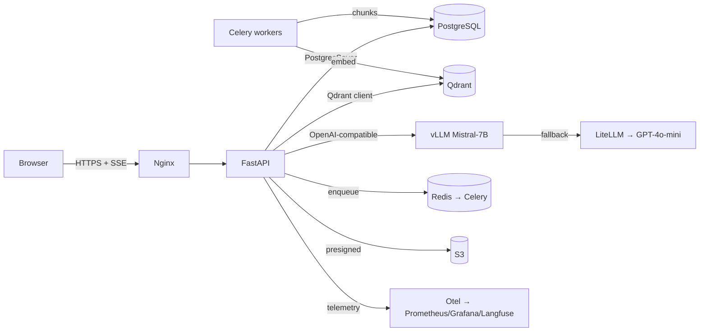

# 02 — Complete System Architecture

## System context (C4 L1)



## Container diagram (C4 L2)



## Runtime architecture



## Design decisions

| Decision | Choice | Why |
|---|---|---|
| Orchestrator runtime | LangGraph (Python) | Explicit state machine, checkpointing, interrupts, Send-API parallelism |
| Sync + Async split | FastAPI sync routes, Celery for ingestion | Avoid CPU-heavy embedding in the request path |
| Single writer for answers | LangGraph `finalizer` node persists once | No duplicate/concurrent writes after streaming |
| Streaming | SSE (not WebSocket) | Fire-and-forget server→client; simple infra, proxies well |
| Model serving | vLLM (not TGI/Ollama) | Throughput + continuous batching + prefix caching at low cost |
| Fallback | LiteLLM → GPT-4o-mini | Escape hatch when fine-tuned model fails or is unavailable |

## Deployment topology

```mermaid
flowchart LR
    subgraph AWS["AWS"]
        subgraph region[us-east-1]
            VPC[VPC]
            subgraph tier1[Web/API tier]
                ALB[ALB]
                API1[API · Fargate]
                API2[API · Fargate]
            end
            subgraph tier2[Data tier]
                RDS[(RDS Postgres)]
                RED[(ElastiCache)]
                QDR[(Qdrant on EC2/ECS)]
                S3[(S3)]
            end
            subgraph tier3[Inference]
                G[R[g5.2xlarge]]
            end
        end
    end
```