# 04 — Complete User Interaction Flow

The full end-to-end journey a real user takes, with every backend operation
annotated, from login to the streamed answer.

## 1. The annotated flow

```mermaid
flowchart TD
    A["1. User logs in (SSO or email/password)"] --> B
    subgraph authN[Auth plane]
        B["2. FastAPI validates credentials → JWT pair<br/>(offline password-hash check vs PG)"]
        C["3. Refresh token stored as opaque session; jti tracked"]
    end
    B --> D["4. Next.js stores access/refresh in httpOnly cookie"]
    D --> E["5. User creates/opens a workspace (RBAC membership check)"]
    E --> F["6. User uploads documents (multipart)"]
    F --> G["7. Upload validated: type/size/mime magic"]
    G --> H["8. Byte stream written to S3 (s3_key); Document row created status=PENDING"]
    H --> I["9. Celery .delay(process_document)"]
    I --> J{10. Celery worker pick cards}
    J --> K["validate → extract text (pdf/docx/txt/csv)"]
    K --> L["chunk (tiktoken, 512/64, sentence-aware)"]
    L --> M["11. Qdrant ensure_collection (once)"]
    M --> N["12. per-chunk embed + upsert with workspace_id payload"]
    N --> O["13. Document → READY; chunk_count stored"]
    O --> P["14. User opens a conversation (creates thread_id)"]
    P --> Q["15. User asks a question"]
    Q --> R["16. FastAPI saves user Message(row), opens SSE stream"]
    R --> S["17. LangGraph run_conversation_stream(thread_id)"]
    S --> T["18. Planner decomposes into tasks + capability flags (needs_retrieval/web/tools)"]
    T --> U["19. Route: tools? executor : (research? researcher : finalizer)"]
    U --> V["20. Researcher: embed query → Qdrant search (tenant filter) → claims + confidence"]
    V --> W["21. Executor: LLM tool selection → validate args → safe run → tool_results"]
    W --> X["22. (optional) sensitive action → interrupt → human approval gate"]
    X --> Y["23. Finalizer: answer + citations"]
    Y --> Z["24. Critic: score; <0.7 → re-research loop (max 3)"]
    Z --> AA["25. Answer streamed back as SSE events (plan/agents/tokens/answer)"]
    AA --> AB["26. Backend persists assistant Message + per-agent usage/cost rows"]
    AB --> AC["27. Frontend renders chat with citations + cost/usage badge"]
```

## 2. Call-by-call walkthrough (backend operations)

Below is the exact sequence for a typical "finance" query with retrieval.

| # | Operation | Component | Storage touch | Notes |
|---|---|---|---|---|
| 1 | Login: `POST /api/v1/auth/login` | FastAPI | PG | bcrypt verify → JWT access (+refresh); refresh serialized to Redis |
| 2 | `POST /api/v1/workspaces` | FastAPI | PG | idempotent slug; role OWNER |
| 3 | `POST /workspaces/:id/documents` | FastAPI | S3 | multipart → validate → S3 PUT; 202 |
| 4 | Celery `process_document` | worker | PG, S3 | status PROCESSING |
| 5 | `extract_text_bytes` | worker | S3 | pypdf/python-docx |
| 6 | `chunk_text` | worker | CPU | tiktoken |
| 7 | `embed_texts` | worker/API | GPU | batch |
| 8 | `upsert_chunk` | worker | Qdrant | payload tenant |
| 9 | `POST /workspaces/:id/conversations` | API | PG | thread_id = checkpoint key |
| 10 | `POST /conversations/:id/messages/stream` | API+Graph | PG/Redis | user message saved; graph invoked |
| 11 | `run_conversation_stream` | Orchestrator | PG checkpoint | astream_events |
| 12 | planner → researcher → … → critic | Orchestrator | PG usage | max 3 critic loops |
| 13 | `persist_usage` + message write | API async | PG | UsageRecord per agent |
| 14 | SSE `done` event | API | — | client closes stream |

## 3. The 19 UX beats in detail

1. **Login** — SSO (Okta/Auth0) or email+password; JWT access (30m) + refresh
   (7d) set as HttpOnly cookies.
2. **Workspace** — tenant partition: all documents, conversations, vectors filtered by
   `workspace_id`.
3. **Upload documents** — drag&drop; accepted types (pdf/docx/txt/md/csv); max
   50MB; upload status reflected instantly.
4. **Validate** — client checks MIME + size; server re-checks; reject with typed
   error (`validation_error`, `unsupported_format`, `payload_too_large`).
5. **Store** — stream to S3 keyed `documents/<uuid>`, metadata in `documents` row.
6. **Chunk** — tiktoken cl100k; `chunk_size=512`, `overlap=64` (init config);
   chunks pushed to sentence boundaries by paragraph splitting.
7. **Embed** — Sentence Transformer `BAAI/bge-small-en-v1.5` ONNX, dim 384,
   normalized; batch of 64.
8. **Vector update** — Qdrant upsert with payload `{workspace_id, document_id,
   chunk_index, text}`; per-doc delete on replace.
9. **Question** — SSE stream request; messages persisted; per-Message row.
10. **Classification** — Planner returns task list + `needs_*` flags (LLM JSON).
11. **Graph start** — StateGraph with `thread_id`; checkpoint on (PostgresSaver).
12. **Plan** — planner JSON; tasks list fed to researcher/executor.
13. **Retrieve** — hybrid (BM25 optional) Qdrant search w/ tenant filter; top-k 6.
14. **Tool calls** — executor picks from schema list; JSON-schema validation before
    runtime; calls recorded.
15. **Memory** — conversation history from checkpoint (short-term) + long-term
    facts from `PostgresStore` (user-long-term).
16. **Critic** — scores draft; loop max 3 with best-effort final.
17. **Answer** — finalizer returns answer + citations serialized to SSE.
18. **Stream** — tokens via `on_chat_model_stream` → `token` events; answer at end;
    SSE closed by client.
19. **Post-response** — usage rows written; dashboard/billing updated; feedback
    buttons recorded to audit log.

## 4. Failure handling

| Stage | Failure | Response to user |
|---|---|---|
| Upload | invalid type/size | 4xx typed error; metadata preserved |
| Chunking | empty document (no text) | status FAILED + human-readable reason in UI |
| Embedding API down | `UpstreamError` → retry (expo backoff 3x) then `Failed_Document` |
| vLLM down | LLMUnavailableError → route to `fallback_model_id`, if configured fail `503` |
| Graph loop exceeds max | critic retry budget spent → deliver best-effort with note `confidence` exposure |
| Interrupt | email/py code | server holds; UI shows "awaiting approval" + ✉ approve/reject |

## 5. Idempotency & consistency

- Upload `POST` → deterministic `s3_key` from client-supplied `X-Idempotency-Key`;
  duplicate returns existing document.
- Long-running graph: checkpoints every step — a resume endpoint can pick the
  thread from any DB record.
- Exactly-once usage accounting: `UsageRecord` rows keyed by
  `(conversation_id, agent, model_id, created_at::hour)` dedup.