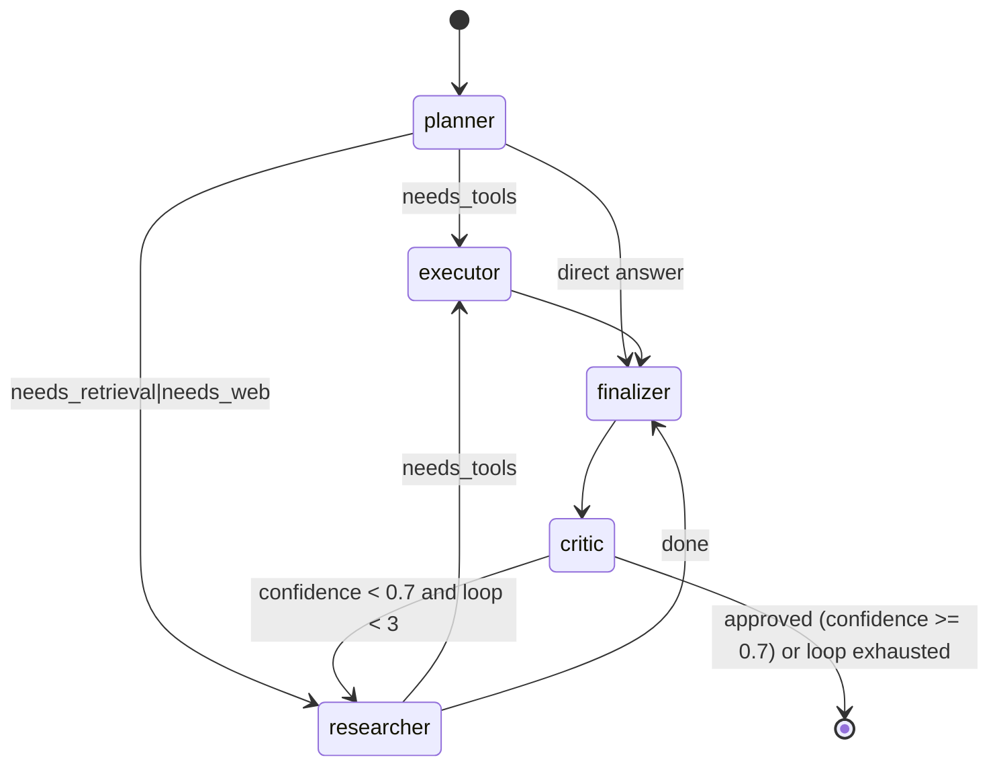

# 05 — LangGraph Multi-Agent System Design

How the state machine is implemented: graph states, transitions, conditional
routing, memory, handoffs, retries, errors, HITL, interrupts, checkpointing,
parallelism, and streaming.

## 1. Graph state

`AgentState` is a `TypedDict` shared across all nodes. Channels annotated with
`Annotated[list[T], operator.add]` **accumulate** — every node that returns them
appends; scalar channels are **overwritten** by the latest writer.

```python
from typing import Annotated, TypedDict, Any
import operator

class AgentState(TypedDict, total=False):
    input: str
    workspace_id: str
    conversation_id: str
    messages: Annotated[list[dict[str, Any]], operator.add]   # thread history
    plan: str
    tasks: Annotated[list[dict[str, Any]], operator.add]      # planner split
    needs_retrieval: bool
    needs_web: bool
    needs_tools: bool
    current_agent: str
    research_notes: Annotated[list[ResearchNote], operator.add]
    retrieved: Annotated[list[ContextChunk], operator.add]    # Qdrant results
    tool_results: Annotated[list[ToolResult], operator.add]   # executor effects
    citations: Annotated[list[str], operator.add]
    critique: str
    confidence: float
    iterations: int
    usage: Annotated[list[dict[str, Any]], operator.add]      # cost accounting
    answer: str
    pending_approval: str
    approval_decision: str
```

Implementation: `backend/app/graph/state.py`.

## 2. Graph topology & conditional routing



- **Routing functions** are plain Python (no LLM) — deterministic, cheap, testable.
- Rolling up planner output (flags) maps 1:1 to explicit edges.

## 3. Node → partial state contract

Every node receives the latest state snapshot and returns a *partial update*:

```python
def planner_node(state: AgentState) -> dict:
    completion = chat_with_fallback([...planner prompt...], agent="planner")
    parsed = json.loads(completion.content)
    return {
        "plan": parsed["strategy"], "tasks": parsed["tasks"],
        "needs_retrieval": parsed["needs_retrieval"],
        "needs_tools": parsed["needs_tools"],
        "usage": [{"agent": "planner", "model": completion.model,
                    "input_tokens": completion.input_tokens,
                    "output_tokens": completion.output_tokens,
                    "cost_usd": completion.cost_usd}],
    }
```

## 4. Memory management

| Kind | Mechanism | Where |
|---|---|---|
| Short-term | thread checkpoint (PostgresSaver) | every step persisted per `thread_id` |
| Conversation session | checkpoint readback | from checkpoint |
| Long-term (facts/prefs) | `postgres_store` namespaced `(user_id, topic)` | `PostgresStore` |
| Vector (workspace KB) | Qdrant | tenant-filtered |
| Summarization | `summarize_messages` token budget | `app/memory/context.py` |

Session context is re-injected into the planner prompt each turn.

## 5. Interrupts & human-in-the-loop (HITL)

Sensitive tools (`send_email`, `run_python`) declare `needs_approval=True`. In
the executor node we call `interrupt()` so the graph **pauses**:

```python
from langgraph.types import interrupt

decision = interrupt({
    "tool": tool_name,
    "args": args,
    "question": "Approve sending the win-back email to acme@corp?",
})
if decision != "granted":
    return {"tool_results": [{"tool": tool_name, "args": args,
        "result": "BLOCKED by user", "status": "rejected"}]}
# else run and record result
```

The thread stays check-pointed; the API exposes
`POST /conversations/:id/approve` to resume with `Command(resume="approved")`.
This is **interrupt-based**, not polling: the run is literally suspended.

## 6. Checkpointing

- **PostgresSaver** (`app/graph/checkpointer.py`) → parent visibility: any shard
  can resume any thread. Graph compiled with `checkpointer=`; this enables
  thread history, fault-tolerant resume, and time-travel.
- Without DB, `get_checkpointer()` returns `None` (scaffold/CI mode) — the graph
  still compiles.

## 7. Retry & error handling

- **LLM failures**: the gateway wraps vLLM reachability; `chat_with_fallback`
  retries with exponential backoff then falls back to `fallback_model_id`
  (frontier) and only then raises `LLMUnavailableError`.
- **Tool failures**: caught per tool, recorded with `status="error"` — the graph
  continues instead of crashing.
- **Graph-level**: `run_conversation_stream` catches exceptions, yields an
  `error` SSE event, and re-raises in tests. Celery ingestion tasks use
  `self.retry(countdown=2**retries)`.
- **Budget**: `MAX_ITERATIONS = 3` protects worst-case latency/cost; critic loop
  best-effort exactly once the budget is exhausted.

## 8. Parallelism & async

- **Fan-out**: researcher sub-questions could use `Send()` for parallel research
  (map/fan-out/join). Currently retrieval is a single top-k call; the map-reduce
  pattern is documented for multi-modal/multi-source cases (see `docs/20`).
- **Async**: node functions are synchronous to simplify; FastAPI drives the SSE
  generator (`async for event in graph.astream_events(...)`). CPU-heavy
  embedding/token work moves to Celery workers to keep the request loop free.

## 9. Streaming contract (SSE)

| SSE event | Payload | Emitted by |
|---|---|---|
| `plan` | tasks + flags | planner |
| `agent_start` / `agent_end` | agent name | graph lifecycle |
| `token` | `{agent, delta}` | `on_chat_model_stream` |
| `tool_call` / `tool_result` | tool, args, outcome | tool hooks |
| `evidence` | research notes w/ confidences | researcher |
| `answer` | final answer + citations + confidence | finalizer |
| `human_approval` | question payload | interrupt |
| `error` | message | exception |
| `done` | — | finalizer exit |

Frontend simply `EventSource`es the URL; each `data:` frame is `json.dumps(evt)`.

## 10. Design decisions & trade-offs

| Decision | Alternative | Trade-off |
|---|---|---|
| Single graph with explicit edges | one "super-agent" doing everything | Controllable, testable, auditable vs. generality |
| Deterministic routing (Python) | LLM-judged routing | Cheap/predictable vs. flexible |
| Max 3 critic loops | unlimited critic | Worst-latency cap vs. best quality |
| Research sequential now | parallel Send() | simplicity; parallelize at high traffic |
| Checkpoints to Postgres | Redis snapshots | durability/resume vs. write load |
| sync nodes + async streamer | fully async graph | simpler telemetry vs. concurrency ceiling |