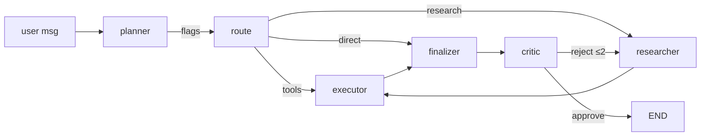

# 06 — Agent Design

Four specialized agents, each with a strict input/output contract, prompt,
tools, memory, failure handling, confidence, and handoff conditions.

## 1. Agent map

| Agent | Purpose | Inputs | Outputs | Tools | Handoff when |
|---|---|---|---|---|---|
| **Planner** | Decompose request into ordered tasks + capability plan | `input`, workspace context | `plan`, `tasks[]`, `needs_retrieval/web/tools` | none | plan complete |
| **Researcher** | Gather grounded evidence (KB + web) | `input`, `plan`, `tasks` | `retrieved[]`, `research_notes[]`, `citations[]` | `retrieve_documents`, `web_search` | evidence ready with confidence |
| **Tool Executor** | Fulfill tool-dependent tasks | `tasks`, `input` | `tool_results[]` | calculator, weather, tickers, sql (RO), email draft/send (approval) | tools exhausted / NO_TOOL |
| **Critic** | Score draft; approve or reject for revision | `input`, `answer`, `research_notes` | `critique`, `confidence`, `iterations` | none | score ≥ 0.7 or loop budget spent |

## 2. Planner agent

- **Purpose**: turn an open-ended request into an ordered, bounded plan; classify
  the capability needs of the request (retrieval/web/tools/none).
- **Prompt** (system, truncated for doc):
  ```
  You are the Planner agent of a research system. Decompose the user's request into
  a concise, ordered task list. Decide which capabilities are needed: RETRIEVAL,
  WEB, TOOLS, NONE. Respond as strict JSON with keys:
  {"tasks": [...], "needs_retrieval": bool, "needs_web": bool, "needs_tools": bool, "strategy": "..."}
  ```
- **Output contract**: JSON only; the node parses, falls back to a safe default
  plan (`[input]`, `needs_retrieval=true`) on malformed JSON.
- **Handoff**: deterministic Python routing — tools → executor; research →
  researcher; else finalizer.
- **Failure**: retry once (temperature 0); on second failure degrade to default
  plan (still grounded).

## 3. Researcher agent

- **Purpose**: gather *grounded* evidence. Retrieves from the tenant Qdrant
  store (hybrid: dense embeddings + optional BM25) and optionally the web.
- **Input**: user question, plan, retrieved chunks (top-6).
- **Output**: `research_notes[]` each `{claim, evidence, source, confidence}` —
  confidence is per-claim (0–1) so the critic can weigh weak evidence.
- **Prompt**:
  ```
  Using only the provided retrieved evidence and your own knowledge, produce up to
  five factual claims relevant to the plan. For each claim return JSON:
  {"claim", "evidence", "source": "doc:<id>" | "web", "confidence": 0.0-1.0}.
  Do not invent facts; if evidence is weak, lower confidence.
  ```
- **Failure**: empty retrieval → explicit `weak_evidence` note; planner route
  reconsiders; the answer will carry low confidence & caveats.
- **Confidence**: per-claim; the graph's final confidence = weighted mean
  (evidence-derived).

## 4. Tool Executor agent

- **Purpose**: make live-data or side-effectful tasks concrete: calculations,
  weather/tickers, read-only SQL, emails.
- **Input**: task checklist + user request.
- **Output**: `tool_results[]` with status `ok|error`; every call validated
  against the tool's JSON schema **before** execution.
- **Tool selection**: LLM function-calling over the provided schemas; the
  registry enforces policy (`needs_approval`, disabled tools are never exposed).
- **HITL**: `send_email` / `run_python` are approval-gated via `interrupt()`.
- **Failure**: per-tool try/except; failures recorded and surfaced, never fatal.

## 5. Critic agent

- **Purpose**: verify the draft against the brief + evidence; reject if below
  threshold so the loop can revise.
- **Prompt**: `{"request", "draft", "notes"}` → `{"score": 0.0-1.0, "issues": [...], "revised_answer"}`.
- **Confidence contract**: `score >= 0.7` = approve. Loop budget `MAX_ITERATIONS=3`.
- **Failures**: malformed JSON → treated as `score=0.5` (retry once).

## 6. Shared patterns

- **System prompt registry** in `backend/app/agents/nodes.py` — single source.
- **Usage/cost**: every agent completion appends a usage entry to state;
  persisted as `UsageRecord` (see `docs/10`, `docs/14`).
- **Traceability**: node names are the SSE `agent` field; Langfuse spans named
  per agent.

## 7. Agent handoff table (state transitions)

