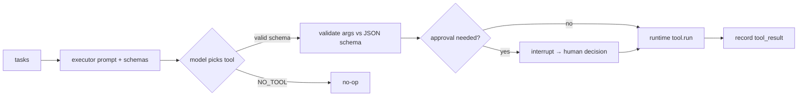

# 07 — Tool Calling System

How tools are integrated, selected, executed safely, and observed.

## 1. Tool primitive

Every tool is a plain function wrapped with an explicit **JSON Schema**,
permission flags, and a strict `run()` path:

```python
@dataclass(frozen=True)
class Tool:
    name: str
    description: str
    parameters: dict           # JSON Schema subset
    func: Callable[..., Any]   # implementation
    needs_approval: bool = False
    read_only: bool = True

    def openai_schema(self): ...   # for LLM tool discovery
    def run(self, args):           # validate → execute → stringify
```

`run()` does JSON-schema validation (`jsonschema.validate`) **before** calling
anything, so argument injection is bounded.

## 2. Catalog

| Tool | Capability | Read-only | Approval | Notes |
|---|---|---|---|---|
| `web_search` | live web (DuckDuckGo Lite) | ✅ | — | keyless, rate-limited |
| `calculator` | arithmetic safely (AST) | ✅ | — | rejects code exec |
| `retrieve_documents` | tenant Qdrant top-k | ✅ | — | workspace-filtered |
| `get_weather` | Open-Meteo | ✅ | — | free, current `current_weather` |
| `get_tickers` | yfinance price info | ✅ | — | optional dep |
| `run_sql_query` | read-only SQL gateway | ✅ | — | only SELECT; per-workspace allowlist |
| `draft_email` | compose draft | ✅ | — | never sends |
| `send_email` | send | ❌ | **required** | gated via interrupt |
| `run_python` | execute snippet | ❌ | **required** | sandbox, off by default |

## 3. Selection logic

1. Planner emits `needs_tools`; executor node is routed to only.
2. The executor LLM call is given the subset of schemas matching the task
   (safe subset by default).
3. The model returns function calls; each call is resolved by `get_tool(name)`,
   validated with `run()`, and results appended to `tool_results`.
4. `NO_TOOL` responses shortcut additional turns.
5. Disabled/approval-gated tools are never part of the exposed schema unless a
   workspace feature flag adds them.



## 4. Execution policy

- **Sandboxing**: Python executor is *disabled* by default; calculator restricts
  AST to a fixed operator set (no attribute/call access).
- **Side effects**: only approval-gated tools can write; `send_email` always
  paused at `interrupt()`.
- **Logging**: every call is traced (Langfuse + Prometheus counter
  `conductor_tool_calls_total{tool}`, latency histogram).
- **Short-circuit**: tools recording a failure (`status:error`) are retried once,
  then the result is surfaced transparently; the graph never crashes on a tool.

## 4. Extending

Add a function + a `Tool` in `backend/app/tools/definitions.py` and register it
in `registry.ALL_TOOLS`. It appears automatically in the executor's schema and
in the docs table above. New side-effecting tools must set `needs_approval=True`.