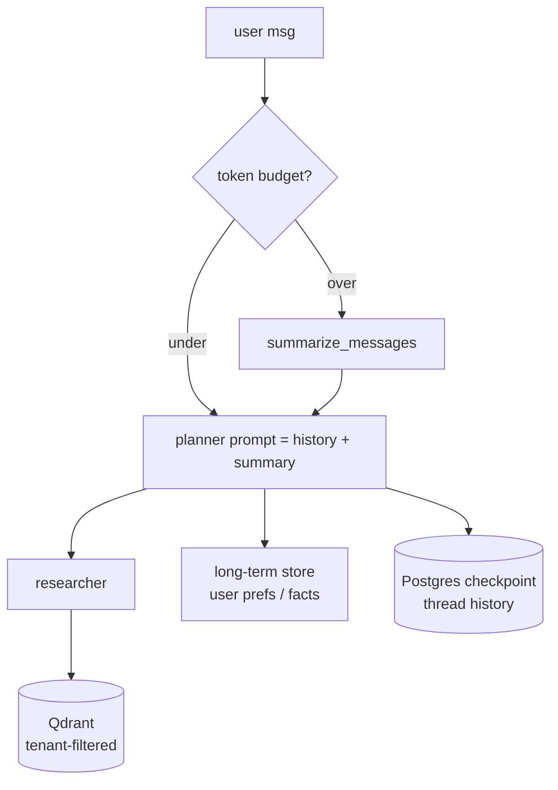

# 08 — Memory Architecture

Memory in a multi-agent system has different *kinds* with different lifetimes
and mechanics. Conductor implements all of them explicitly.

## 1. The memory stack

| Kind | Lifetime | Store | Access |
|---|---|---|---|
| **Short-term** (working) | single request | LangGraph `AgentState` | node-internal |
| **Conversation/session** | per thread (days) | PostgresSaver checkpoints | every turn |
| **Long-term facts/prefs** | indefinite (per user) | PostgresStore namespaces | injected to planner |
| **Vector memory** (KB) | workspace scope | Qdrant (tenant-filtered) | researcher |
| **Summarized memory** | rolling | derived, cached in Redis | after N turns |
| **Eviction** | policy | token budget | per prompt |



## 2. Short-term memory (AgentState)

State channels (`messages`, `research_notes`, `tool_results`, `usage`) accumulate
with `operator.add`. The planner writes the plan; every downstream node reads the
accumulated state. This is the *working set* for one request.

## 3. Conversation (session) memory

- LangGraph `thread_id` ↔ conversation; PostgresSaver persists **every step**.
- On resume, the planner prompt includes recent turns from the checkpoint
  (via `graph.get_state(config)`).
- No custom table needed — the checkpointer *is* the conversation memory; the
  `messages` relational table mirrors it for the UI/history API.

## 4. Long-term memory

- Namespaces: `(user_id, "preferences")`, `(user_id, "facts")`, `(user_id, "topics")`.
- Stored via `PostgresStore` (production) — survives restarts; the facade in
  `backend/app/memory/store.py` (`remember/recall/list_memories`).
- Extracted by a background job: after each conversation, summarize → persist
  facts (deduplicated by key).

## 5. Vector memory

- The workspace knowledge base is *not* the same as chat memory: Qdrant holds
  document chunks; the researcher retrieves with a `workspace_id` filter.
- Query-time vector cache: embedding results cached in Redis (TTL 24h) so
  repeated similar questions don't re-embed.

## 6. Summarization & eviction

```python
def summarize_messages(messages, max_tokens=8192):
    total = sum(token_count(m["content"]) for m in messages)
    if total <= max_tokens:
        return messages
    kept = []; used = 0
    for m in reversed(messages):          # keep the tail (recent)
        c = token_count(m["content"])
        if used + c > max_tokens - header: break
        kept.insert(0, m); used += c
    return [summary_stub, *kept]
```

- Trigger: history crosses `MAX_CONTEXT_TOKENS` → summarize with the (fine-tuned)
  model; the summary becomes a `system` message.
- **Eviction policy**: keep last 12 messages raw, summarize older ones; the
  summary itself is evicted from the prompt after 30 turns (re-summarize then).

## 7. Memory pitfalls we engineered around

- **Prompt bloat** — token budget enforced at prompt-build time.
- **Stale facts** — long-term facts carry `updated_at`; stale keys are refreshed
  or dropped by the summarizer job.
- **Tenant bleed** — every vector and store lookup is workspace/user scoped at
  the query layer, never by prompt instruction alone.
- **Cost** — memory reads are cache-first (Redis), model calls only when
  summarization is required (≈ once per N turns).