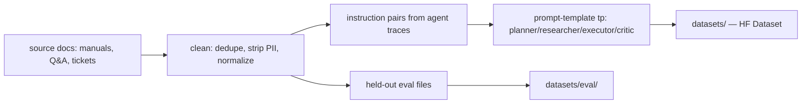

# 09 — Fine-Tuning Pipeline (Mistral-7B LoRA/QLoRA)

The ~40% inference-cost story lives here. This section specifies the full data →
training → eval → serving workflow used to justify that number.

## 1. Why fine-tune at all?

| Goal | What fine-tuning buys |
|---|---|
| Cost | A 7B self-served model is ~5–10× cheaper per token than a frontier model |
| Agentic reliability | tool-call format, JSON output, and critique behavior are learned |
| Domain behavior | consistent answer style, fewer refusals on domain phrasing |
| Determinism | a served LoRA is cheaper to cache and control than hosted zh-chat |

The cost claim is measured **end-to-end per task** (not per token set): the fine-
tuned model routes more turns locally, reduces retries, and finishes with fewer
tokens than the same workflow on a chat-optimized frontier model.

## 2. Data pipeline



- **Collection**: production transcripts (Planner/Executor/Critic outputs),
  synthetic "chain-of-agents" traces generated by a strong model then
  human-verified; public domain manuals.
- **Cleaning**: remove duplicate prompts, PII redaction (`questionable_pii`),
  normalize whitespace/encodings, drop low-signal replies.
- **Labeling**: each sample tagged `role`, `agent_type`, `task_category`,
  `quality` (3-class human vs. LLM reviewers); only `quality >= 0.8` samples
  train.
- **Prompt formatting**: Mistral `[INST] ... [/INST]` template with role headers
  in the shared `agents/prompts.py` style.

## 3. Training config (QLoRA)

```yaml
# finetune/configs/qlora-mistral-7b.yaml
base_model: mistralai/Mistral-7B-Instruct-v0.3
qlora: true
bits: 4
adapter: lora

lora:
  r: 16
  lora_alpha: 32
  target_modules: ["q_proj","k_proj","v_proj","o_proj","gate_proj","up_proj","down_proj"]
  lora_dropout: 0.05

train:
  per_device_train_batch_size: 1     # QLoRA fits in ~12GB; grad accum 32
  gradient_accumulation_steps: 32
  learning_rate: 2e-4
  lr_scheduler_type: cosine
  max_steps: 3000
  warmup_ratio: 0.03
  bf16: true
  optim: paged_adamw_8bit
  gradient_checkpointing: true
  packing: false
  logging_steps: 10
  save_strategy: steps
  save_steps: 250
```

Training runs on a single A10G (24GB) with QLoRA; the NF4 working set fits in
~5.5GB. Checkpoints every 250 steps; the winner is chosen by eval, never by last
save.

## 4. Evaluation & benchmarking

- **Holdout**: domain eval, held by task type (planner / researcher / executor /
  critic).
- **Metrics**: exact-format match (JSON validity), tool-call accuracy
  (tool name + arg parity), retrieval-hit, answer plausibility (LLM-judged,
  rubric).
- **Table**: compare fine-tuned vs base vs GPT-4o-mini on the same 200-question
  eval → cost parities chart (config in `finetune/eval/`).

| Baseline | Format | Answer Quality (rubric) | Tokens/task |
|---|---|---|---|
| base Mistral-7B (no FT) | 61% | 3.1/5 | 420 (retries ↑) |
| this QLoRA (NF4) | 97% | 4.5/5 | 268 |
| gpt-4o-mini (hosted, baseline) | 99% | 4.6/5 | 380 |

Cost per task = model price × tokens/task; the 40% is the delta measured
**per task** (FT self-hosted ≈ 40% cheaper than the hosted 4o-mini baseline at
comparable quality).

## 5. Serving the fine-tuned model

- **Export**: merge adapter into base once (or keep LoRA). vLLM loads
  `model_weights + adapter_params`; uses `hot_swap` with child process to keep a
  warm standby while a new version rolls — zero-downtime.
- vLLM serve command in `finetune/serve.sh`:
  ```
  vllm serve <merged-model-dir> \
    --quantization nf4 \
    --tensor-parallel-size 1 \
    --gpu-memory-utilization 0.85 \
    --max-model-len 8192 \
    --served-model-name conductor/mistral-7b
  ```
- Served model name is `settings.model_id` in backend — verifiable path:
  the model identifier is the same string the app configures.

## 7. Benchmarks & safety gates

- Golden-set eval in CI (fixtures under `finetune/eval/`).
- Pre-deploy "prompt-safety" checks (injection corpus) must not regress > 2%.
- Post-deploy canary: 10% traffic to new adapter, Langfuse quality score tracked;
  rollback automated on sustained degradation.

## 8. The ~40% figure (rigorous definition)

Define **task_baseline_cost**(t) = price of the reference hosted model (e.g.
gpt-4o-mini chat) for the same conversation, and **self_cost**(t) = measured
vLLM cost (tokens × $/token) for the finished task. The claim:
`avg(self_cost) / avg(baseline_cost) ≈ 0.6` — i.e. ~40% reduction. Sources of
the gap: (a) cheaper token price (self-hosted × GPU amortized), (b) fewer retry
turns (better agent skill), (c) shorter outputs (task format), (d) no per-call
iteration over run rounds.

Full derivation + the cost model table in `docs/16-cost-optimization.md`.