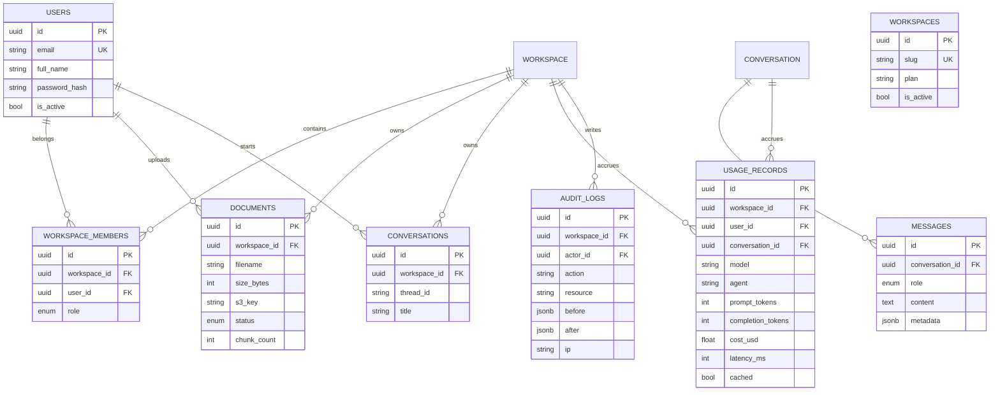

# 11 — Database Design

PostgreSQL for the relational system; Qdrant for vectors; Redis for cache/queues;
S3 for documents. ER diagram, schema, indexes, and optimization notes.

## 1. ER (entities and relationships)



## 2. Table notes & relationships

- **users** — identity; passwords bcrypt-hashed; `email` unique (case-folded).
- **workspace_members** — role per member (owner/admin/member/viewer) for RBAC.
- **document_status** — enum lifecycle `pending|validating|processing|ready|failed`.
- **message_role** — `user|assistant|tool|system`; assistant rows carry a
  `metadata` bucket for token counts / citations.
- **usage_records** — one row per agent completion; primary analytics table.
- **audit_logs** — append-only; `before/after` JSONB snapshots.

## 3. Indexes

```sql
CREATE INDEX ix_workspace_members_user ON workspace_members (user_id);
CREATE INDEX ix_workspace_members_workspace ON workspace_members (workspace_id);
CREATE UNIQUE INDEX uq_workspace_user ON workspace_members (workspace_id, user_id);
CREATE INDEX ix_documents_workspace ON documents (workspace_id, created_at DESC);
CREATE INDEX ix_messages_conversation ON messages (conversation_id, created_at);
CREATE INDEX ix_usage_workspace_time ON usage_records (workspace_id, created_at DESC);
CREATE INDEX ix_usage_agent_model ON usage_records (agent, model_id);
CREATE INDEX ix_audit_workspace ON audit_logs (workspace_id, created_at DESC);
```

## 4. Vector store (Qdrant)

- One collection `conductor_documents`, vector size = `EMBEDDING_DIM` (384),
  cosine distance.
- **Tenant isolation**: payload `workspace_id` + `document_id` + `chunk_index`;
  query filtered with `must:[workspace_id]`.
- Filtered uploads are on-disk payload; vectors in memory (faster filter).
- Deleting a document → filter-delete by `(workspace_id, document_id)`.

```mermaid
flowchart LR
    DOC[document row] --> CH[chunks via tiktoken]
    CH --> EM[embed BGE-384]
    EM --> QD[qdrant point<br/>workspace_id|doc|chunkidx|<vec>]
    QUERY[q.user] --> QSEARCH[filter workspace_id]
    QSEARCH --> TOPK[top-6]
```

## 5. Checkpoint & state storage

- LangGraph checkpoints → PostgresSaver tables (in the same PG instance,
  schema `checkpoint`, tables `checkpoints`, `checkpoint_writes`, `blobs`).
- Long-term memory store → `PostgresStore` namespaced tables.

## 6. Optimization strategies

- **Read model** — chat/history endpoints use `LIMIT/OFFSET`-free cursor vs
  windowed scans; messages denormalized to recent-N for the UI.
- **Hot tables** — `usage_records`, `messages` partition by month
  (PG range partitioning) once > 10M rows.
- **Caching** — Redis TTL lists for: workspace document list (30s),
  conversation summary (1h), embedding cache (24h).
- **Connection pooling** — SQLAlchemy pool (size 10, overflow 20) per worker;
  server-side cursors for big lists.
- **Write batching** — usage rows bulk-inserted by the worker every 10s, not
  per-agent commit in the request path.

## 7. Multi-tenancy at the DB layer

- Row-level scoping: `workspace_id` filter on every query through a
  SQLAlchemy `get_workspace` dependency (never user-supplied SQL).
- Workspace membership enforced in `require_role` — deletes/creates only via
  those paths.
- Vector layer gets tenants via Qdrant payload filters (not prompts).