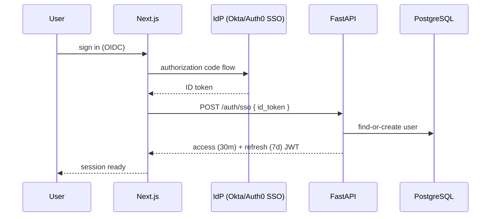

# 12 — Security

Authentication, authorization, prompt-injection defense, tenant isolation,
secrets management, and compliance posture for a production multi-tenant SaaS.

## 1. Authentication

- Access token: signed JWT (HS256/RS256), 30m, claims `sub`, `type`, `role`.
- Refresh token: 7d, single-use rotation; jti blocklisted on reuse → revoke.
- Passwords (when no SSO): bcrypt cost 12; rate-limited login (5/min/IP).

## 2. JWT policy

| Item | Policy |
|---|---|
| Algorithm | RS256 in prod (asym kg), HS256 dev |
| Issuer/audience | `conductor`, API audience |
| `type` claim | separate `access` / `refresh` class (never interchangeable) |
| Revocation | refresh via jti blocklist in Redis (TTL = token expiry) |
| Clock skew | allowed 30s |

## 3. RBAC

| Role | Can |
|---|---|
| owner | manage billing, settings, members, all data |
| admin | manage members/docs, view usage, approve actions |
| member | chat, upload, approve own drafts |
| viewer | read-only access to shared content |

Enforced by `require_role` dependencies + row scope `workspace_id` in every query.

## 4. Prompt-injection & jailbreak defense

Layered (never rely on prompting alone):

1. **Boundary**: user text is *data*, never injected as instructions — tools and
   system prompts are immutable strings.
2. **Sanitization**: strip role-overriding markers / instruction-insulated
   delimiters from retrieved text.
3. **Detection**: classifier (fast, cheap) flags "follow these instructions"
   patterns → degrades the request to retrieval-only.
4. **Tool policy**: tools with side effects REQUIRE approval; SQL read-only;
   python off by default — a jailbreak can't escalate past the tool policy.
5. **Audit**: prompt field logged to Langfuse for post-hoc review; score feed.

## 5. Multi-tenancy / data isolation

- Data scoping: every record carries `workspace_id`; every API query is forced
  through `get_workspace` (membership check) — no classic wiki-style tenant bug.
- Qdrant: vector filter on `workspace_id` in the query itself.
- Object storage: S3 key prefix `{workspace}/{doc}` + IAM bucket policy
  restricting prefix writes (no cross-tenant list).

## 6. Encryption & secrets

- In transit: TLS 1.2+ everywhere (CloudFront + NLB), HSTS.
- At rest:
  - RDS: encrypted (AES-256); Qdrant volumes encrypted; S3 SSE-S3.
  - Application secrets → **AWS Secrets Manager** (rotated), injected as env.
- No secrets in code: `.env.example` only; `.env` gitignored.

## 7. AWS IAM / network

- Least-privilege IAM: each service assumes an identity role with scoped
  policies (API: secrets+db; worker: s3:Get/Put on `documents/*`; inference: ECR
  pull only).
- Security groups: private subnets; only the ingress allowlist hits API/TLS.
- AWS WAF on ALB: SQLi/XSS rules, rate-based rule for /auth, geo blocklists.

## 8. Input validation

- Pydantic v2 at every boundary (bodies, headers, file types+magic, size caps).
- Uploads: `MAX_DOCUMENT_SIZE_MB` + allowlist by magic byte, not extension.
- SQL tool: read-only; SELECT-only allowlist per workspace; query rewritten by
  a parameterizer; cell values never re-surfaced as SQL.

## 9. Compliance & audit

- `audit_logs` append-only rows for member changes, document deletes, approvals,
  usage exports (immutable by IAM restriction).
- Data retention: workspace policy → S3 lifecycle, PG partitioning drops,
  backup retention.
- Posture: SOC2-ish fundamentals (this is the blueprint; formalization is a
  program task).