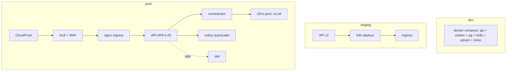
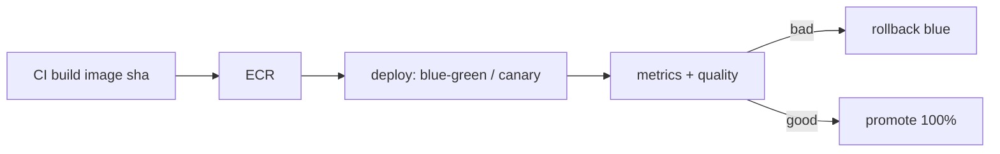

# 13 — Deployment Architecture

Dev / staging / production, containerized and GitOps-driver, with blue-green /
canary release strategy.

## 1. Environment matrix

| Env | What runs | Data | Reset cadence | Protection |
|---|---|---|---|---|
| `dev` | compose: API, workers, PG, Redis, Qdrant, MinIO, vLLM (cpu-less) | disposable | always | none |
| `staging` | EKS namespace + real ML (1 GPU), RDS/ElastiCache/Qdrant | seeded, anonymized | weekly | full IAM/WAF |
| `prod` | multi-AZ EKS, GPU node group for inference | real data | never | WAF, KMS, MFA, SSO |



## 2. Containers & images

- Single repo → `/backend/Dockerfile`, `/frontend/Dockerfile`.
- Images built once in GH Actions, pushed to ECR with `sha` + alias tags.
- Immutable image reference in K8s `image: <repo>@sha256:<digest>` → GitOps
  provenance.

## 3. Blue-green & canary

- **Blue-green**: `kubectl` new ReplicaSet → wait on readiness → flip ingress
  100%; instant rollback via `--pre blue`.
- **Canary (preferred)**: 5% → 25% → 100% over `NGINX_INCLUDE`/Argo weighted
  services; auto-rollback triggered by alert (error budget or quality score).
- For LLM: swap uses the hot-swap warm standby + 10% Langfuse quality canary.



## 4. Auto-scaling & load balancing

- **CPU/API**: HPA target 70% CPU + 200ms p99 latency signal → scale 1→20 API
  pods; HPA behavior: fast scale-up, slow scale-down.
- **Worker**: KEDA on RabbitMQ/Redis queue depth scales injection workers.
- **Inference**: KEDA on concurrent requests/GPU utilization → scale vLLM pods
  (GPU headroom budget). Queued requests route to warm standbys.
- LB: ALB → nginx ingress with sticky sessions off (stateless JWT), health
  probes on `/health/ready`.

## 4. Health checks

- Container liveness: `/health/live` (process).
- Readiness: `/health/ready` (PG, Redis, Qdrant reachability) → k8s drains pods
  not ready.
- GPU pod: vLLM `--lora-modules`-style READY probe + /metrics HP.

## 5. Terraform layout (infra/)

```
infra/terraform/
  modules/
    vpc/           # private/public subnets, NAT, gateway records
    rds/           # postgres, multi-az, automatic minor upgrades
    redis/         # elasticache
    qdrant/        # ECS stateful (persistent volume) or EBS node
    s3/            # buckets + policies + lifecycle
    eks/           # node groups (cpu, gpu), Karpenter
    waf/           # WAF ACLs
    codedeploy/    # canary template
environments/{dev,staging,prod}.tf
```
- Secrets in TF via `sops` or Terraform Cloud vars — never plaintext.

## 6. CI/CD pipeline (GitHub Actions)

```yaml
name: deploy
on: push to main / release tags
jobs:
  lint:  ruff check backend / mypy backend / pytest
  build: docker build (api, worker, front, vllm) → push ECR @sha
  deploy: (staging)  helm + kargo roll-to-staging; run smoke
  canary: (prod) 10% → watch Langfuse error rate → rollout or rollback
```

| Gate | Tool | Bouncer |
|---|---|---|
| lint+type | ruff, mypy | PR block |
| tests | pytest (21 unit now) | block |
| image | buildx cache | — |
| security | `pip-audit`, image scanning (Trivy) | block on critical |
| drift | `terraform plan` comment | review |
| smoke | curl /health + 1 SSE turn | deploy gate |

## 7. Runtime concerns

- **Logs/persistence**: API/worker/config map → Loki; health / leases via PG.
- **Cron/cleanup**: partition daily, prune usage older than 90d to S3.
- **Backups**: RDS daily snapshots + WAL streaming, cross-region for billing;
  tested restore monthly.