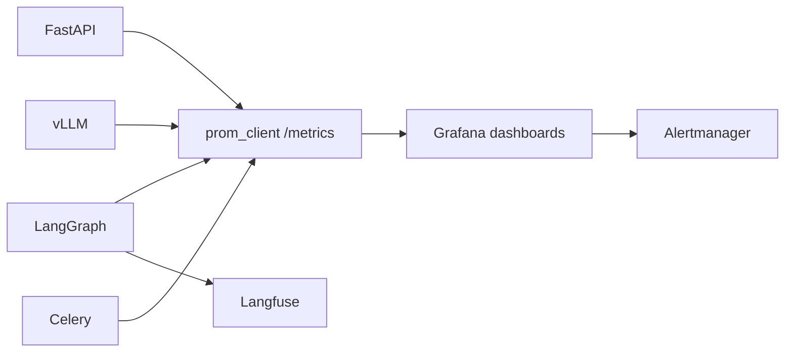

# 14 — Monitoring

Observability for the whole system: logs, metrics, traces, GPU utilization,
token usage, API latency, cost, model quality, and agent failure signals — with
dashboards and alerting.

## 1. Pillars (OpenTelemetry + Prometheus + Loki + Langfuse)

| Pillar | Tool | Covers |
|---|---|---|
| Metrics | Prometheus | latency, QPS, queue depth, GPU, tokens, cost |
| Dashboards/alerts | Grafana | all of the above + SLO/SLA |
| Logs | Loki (structured, correlation-id) | structured JSON lines |
| Traces | OpenTelemetry → Tempo/Jaeger | one request across API/graph |
| LLM traces | Langfuse | prompts, trees, per-call cost, quality |

## 2. Core metric sources

- **API**: request rate, latency histograms (p50/99), error %, active SSE streams.
- **Orchestrator**: `conductor_agent_steps_total{agent}`, `conductor_agent_duration_seconds`,
  `conductor_critic_loops_total{approved,retried}`, checkpoint size DB gauge.
- **Inference (vLLM)**: `ServingMetrics` — throughput tok/s, concurrency,
  request queue, KV-cache hit ratio, GPU util/idle.
- **Ingestion**: `conductor_chunks_indexed_total`, bytes/sec, docs / failed.
- **Tool layer**: `conductor_tool_calls_total{tool}`, `{status}`,
  `conductor_tool_latency_seconds`.



## 3. Dashboards

1. **SRE overview** — uptime, p99 latency, error rate, requests, 5xx count.
2. **LLM economics** — $/day, $/conversation, tokens/day, per-agent split,
   cache hit rate, quantization GPU mem.
3. **Agent health** — per-agent step counts, retry/loop distribution, tool error
   rate, HITL approval rate & median wait.
4. **GPU fleet** — utilization, KV cache fill, queue depth, spot reclaims,
   throughput.
5. **Ingestion** — docs/day, chunk latency, embedding queue depth, failure %.

## 4. SLIs → SLOs → alerting

| SLI | SLO (over 30d) | Alert |
|---|---|---|
| stream start time (request→first token) | p95 < 2s | > 2.5s 15m |
| first token→done | p95 < 40s | > 60s |
| API 5xx | < 0.5% | 1% over 5m |
| agent failure | < 1% completions | 2% over 5m |
| ingestion SLA (doc→READY) | p95 < 3min | > 7min |

Alerts fire to Slack channels (`#alerts-critical`, `#cost`), routed by severity;
on-call rotation for page pages.

## 5. Alerting rules (examples)

```yaml
groups:
  - name: conductor
    rules:
      - alert: VllmGpuUtilizationLow
        expr: vllm:gpu_utilization < 0.1 and up{vllm} == 1
        for: 30m
        annotations: hint "scale_delay - or move to spot"
      - alert: ApiP99LatencyHigh
        expr: histogram_quantile(0.99, rate(http_request_duration_seconds_bucket[5m])) > 2
        for: 10m
      - alert: CostPerTaskAboveBudget
        expr: sum(cost_task_usd) / sum(usage_tasks_total) > 0.5
        for: 1h
      - alert: CriticLoopExhausted
        expr: rate(conductor_critic_loops_total{result="exhausted"}[5m]) > 0.5
```

## 6. Trace + LLM log enrichment

- Correlation id from middleware propagates into OTel span bags + Langfuse.
- Per agent LLM call → Langfuse span name `agent/<name>`, prompt revision,
  meta (model, latency, tokens, cost) — answers "which prompt version produced
  this behavior?" retrospectively.
- Failures tagged `status=error` at graph level; per-error aggregates by phase
  (planner/researcher/executor/critic/ingest).

## 7. Logging conventions

- JSON lines, structured fields: `ts`, `level`, `correlation_id`, `service`,
  `tenant`, `conversation`, `step`.
- Never log PII/passwords/tokens; redact via filters in the logging pipeline.
- Aggregated in Loki with 90d retention; hot queries under 7d.