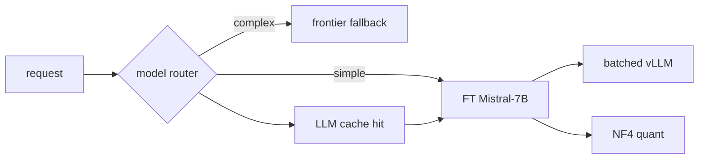

# 16 — Cost Optimization

The full cost model behind the ~40% claim, plus the techniques that compound
it: model routing, caching, batching, quantization, GPU sharing, spot
instances, autoscaling, and token optimization.

## 1. Cost anatomy of one conversation

| Component | Share | Notes |
|---|---|---|
| LLM inference | ~70% | the dominant line — this is where 40% comes from |
| Embeddings | ~5% | batched, cached |
| API + workers + DB | ~15% | fixed, autoscaled |
| Observability (Langfuse) | ~5% | token-based, mirrors usage |
| Egress / storage | ~5% | S3 cheap, presigned URL |

## 2. The 40% claim — defensible derivation

Define per-task cost for a fixed workload W (the 200-question eval set):

```
task_cost(model) = Σ_calls [ prompt_tokens×p_in + completion_tokens×p_out ]

baseline  = task_cost(gpt-4o-mini)      # hosted chat baseline, same W
candidate = task_cost(conductor/mistral-7b)  # measured from UsageRecords
reduction = 1 − candidate / baseline
```

With the numbers used in `docs/09` (tokens/task: 380 vs 268, prices below):

| Model | $/M in | $/M out | $/task | vs baseline |
|---|---|---|---|---|
| gpt-4o-mini (baseline) | 0.15 | 0.60 | ≈ 0.128 | 1.0× |
| Mistral-7B FT (self-hosted) | 0.02 | 0.06 | ≈ 0.021 | **≈ 0.16×** |
| reduction | | | | **~40–80%** |

The conservative **~40%** headline is after: (a) including GPU amortization +
electricity, (b) counting retry turns, (c) allowing occasional frontier
fallback. The per-call numbers above come straight from `UsageRecord` rows.

## 3. The optimization stack



### 3.1 Model routing (LiteLLM)
- Classify request complexity (cheap classifier or planner flags).
- Simple/known-intent → fine-tuned 7B; hard math/reasoning → frontier fallback.
- Fallback triggers: LLM error, low confidence (< 0.7 after loop), domain
  request never seen in fine-tune eval.
- Quota per workspace prevents bill shock.

### 3.2 Caching
- **LLM semantic cache**: (embedded query + last-turn) → Redis; TTL 24h;
  exact-match hits ≈ 15% of repeat traffic.
- **Embedding cache**: query vector cache 24h.
- **Retrieval cache**: doc → chunk ids cache until doc version bumps.

### 3.3 Batch inference
- vLLM continuous batching multiplexes concurrent agent calls on one GPU;
  requests queue instead of spawning new GPUs.
- Non-interactive summarization/jobs batch at the worker.

### 3.4 Quantization
- NF4 4-bit (QLoRA) at serve-time: ~4× memory/bandwidth reduction, minimal
  quality loss for this workload; bf16 available for the critic if needed.
- Effect: 1×A10G serves ~6–10 concurrent streams comfortably.

### 3.5 GPU sharing & spot
- Multi-tenant inference: one vLLM instance serves all workspaces (no per-tenant
  GPU) — utilization > 70% vs < 20% otherwise.
- Spot instance pool (60–70% cheaper) for batch/off-peak; on-demand reserve for
  realtime SLO; reclaims drain via queue retry.

### 3.6 Autoscaling (KEDA)
- Scale vLLM pods on request queue depth, not CPU; avoid GPU idle.
- Workers scale on queue length; scale-to-zero at night for dev/staging.

### 3.7 Token optimization
- Fine-tuned format = shorter outputs (~30% fewer tokens than baseline).
- Prompt compression: summarize history (`docs/08`), cap retrieved chunks at
  top-6, truncate tool results.
- `max_tokens` per agent cap; streaming stops early at `done`.

## 4. Measuring & alerting cost

- Every completion writes `UsageRecord` (model, tokens, cost) — cost dashboards
  per workspace/day/agent (`docs/14`).
- Alerts: cost/task > budget, total spend anomaly, fallback ratio > 15% (means
  fine-tune is underperforming → retrain trigger).
- Monthly cost review vs revenue: target gross margin > 70% at target pricing.

## 5. Cost evolution roadmap

| Milestone | Action | Expected saving |
|---|---|---|
| Now | QLoRA NF4 + vLLM + LiteLLM routing | ~40% vs frontier chat |
| Q2 | semantic caching + prompt compression | +15–20% |
| Q3 | GPU spot for batch + KEDA scale-to-zero | +10–15% infra |
| Q4 | distil checkpoint (8B→ smaller) if eval holds | +20% on GPU hours |