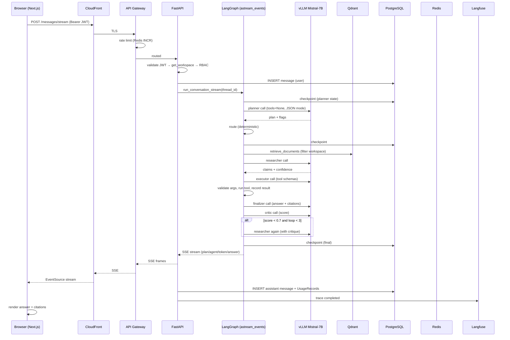

# 20 — Code Flow: Lifecycle of One Request

The complete journey of a single user request through every component — the
map for debugging, on-call, and interviews.

## 1. The full path

## 2. Component-by-component timeline

| t | Component | What happens | Failure mode |
|---|---|---|---|
| 0ms | Next.js | optimistic UI; EventSource opens | 401 → re-login |
| 5ms | Gateway | rate limit + JWT check | 429 envelope |
| 10ms | FastAPI | schema validation, RBAC, thread lookup | 404/403 |
| 20ms | PG | user message insert | retry/500 |
| 25ms | Orchestrator | build input state, start `astream_events` | — |
| 30ms | PostgresSaver | checkpoint per step | fails → no resume; metric |
| 50ms–2s | vLLM | planner call | LLMUnavailable → fallback |
| 50–400ms | Qdrant | tenant-filtered top-k | empty → weak evidence flag |
| +2–8s | vLLM | researcher/executor/finalizer/critic | per-call timeout |
| +8s | Orchestrator | critic loop decisions | budget exhausted → best effort |
| +8–10s | FastAPI | SSE: answer + done; persistence | db errors are best-effort |
| +10s | Langfuse | full trace + cost written | non-blocking |

## 3. Where streaming tokens come from

`graph.astream_events(..., version="v2")` emits:

- `on_chain_start/end` → `agent_start`/`agent_end` (node name in metadata)
- `on_chat_model_stream` → `token` events (delta content)
- `on_tool_start/end` → `tool_call`/`tool_result`
- `on_interrupt` → `human_approval` (executor paused)

The FastAPI `event_stream` generator maps these to SSE `data:` frames; the
frontend assembles deltas per agent bubble.

## 4. Cost & persistence tail

After `done`, in the same request thread (async, best-effort):

1. `INSERT assistant Message` (content + token metadata).
2. For each `usage` entry in state: `persist_usage` → `UsageRecord` row
   (model, agent, tokens, cost) — powers billing + dashboards + the 40% claim.
3. Long-term memory extraction scheduled (Celery, post-response).

## 5. Debugging a bad request (playbook)

1. Grab the correlation id from the UI/network tab.
2. Query Loki: `{service="api"} |= "{correlation_id}"` — find the graph span.
3. Open Langfuse trace by the same id — see each agent's prompt/response/cost.
4. Check Prometheus: `conductor_agent_steps_total{agent}` + critic loop
   distribution; is one agent failing?
5. If tool-related: `conductor_tool_calls_total{tool,status}`; approve/deny
   audit log for HITL paths.
6. If latency: vLLM queue depth + KV-cache metrics; check spot reclaim.

## 6. Testing this flow

- **Unit**: routing (test_graph), chunkers, security, tools.
- **Integration**: FastAPI TestClient + mocked graph (inject fake stream).
- **E2E**: dev compose + a small scripted conversation asserting SSE sequence
  (agent_start → … → done) and DB rows written.