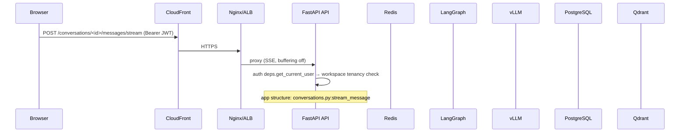
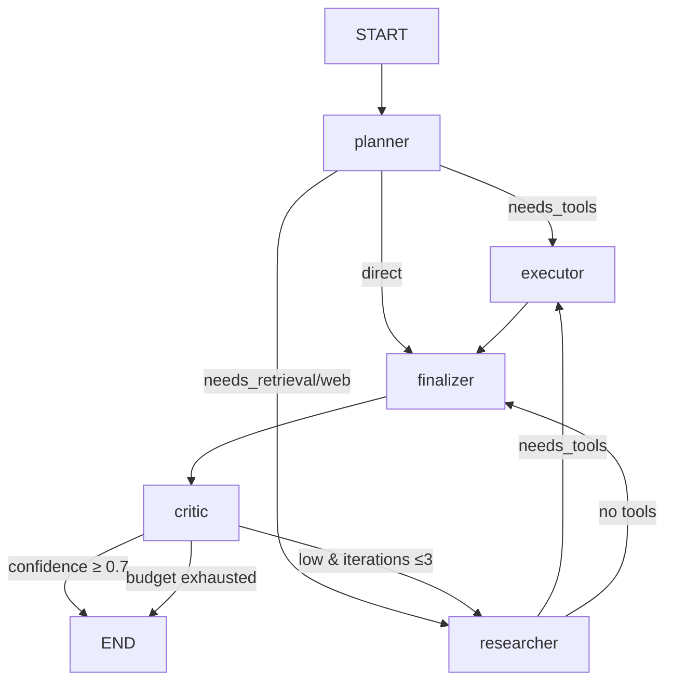

# 20 — Code Flow

Lifecycle of a single user request, from the moment it hits the API until the
final answer streams back. Numbers match real files.

## 1. HTTP in



## 2. API layer (app/api/v1/conversations.py)

```python
db.add(Message(role=USER, content=content))   # persist user turn
db.commit()
return StreamingResponse(event_stream(), media_type="text/event-stream")
```

- Input validated by FastAPI + Pydantic (404/422 typed envelope).
- Concurrency: route is sync/threadpool; each turn one row.

## 3. Orchestrator bridge (app/orchestrator/service.py)

`run_conversation_stream` builds agent inputs and **streams the compiled
graph**:

```python
async for event in graph.astream_events(initial, config=build_config(thread_id), version="v2"):
    kind, node = event["event"], metadata["langgraph_node"]
    if kind == on_chain_start   → yield agent_start(node)
    if kind == on_chat_model_stream → yield token(node, delta)
    if kind == on_tool_start/end    → yield tool_call/tool_result
    if kind == on_interrupt         → yield human_approval
```

Exit conditions: on end → emits `evidence`, `answer`, `done`; terminals
already persisted via `_persist_results` (assistant message + usage rows).

## 4. Inside the graph (app/graph/builder.py)



Each node reads shared `AgentState` and returns a partial update
(accumulated channels append). The executations run synchronously inside the
async event loop via threadpool; tokens are pushed through `on_chat_model_stream`.

### Critical path
1. **planner_node** — prompt with request → JSON `tasks`/`needs_*` → returns
   `plan`, sets `current_agent`.
2. **researcher_node** — `embed_query` → `vectorstore.search(workspace_id,
   q)` with tenant payload filter → context chunks in state; LLM synthesizes
   claims with citations.
3. **executor_node** — OpenAI function-calling with
   `openai_schemas_of(SAFE_TOOLS)`; side-effect tools call
   `interrupt()` for human approval; results appended to `tool_results`.
4. **finalizer_node** — writes `answer` from RAG + citations (+ critic
   feedback on iter_2).
5. **critic_node** — LLM JSON score → `confidence`.

### Streaming back
`finalize` → `on_chat_model_stream` events → SSE `data:` lines → React
`ChatWindow` appends tokens live.

## 5. Persistence + telemetry

After the run, `_persist_results`:
- assistant `Message` (content = final answer, metadata tokens) — one write;
- `persist_usage(db, conv, usage)` per agent step → usage rows → /usage
  endpoint + Prometheus/Langfuse.

## 6. Failure paths

| Failure | Handling | Outcome to user |
|---|---|---|
| vLLM down | `chat_with_fallback` retries/backoff → fallback model | still answers |
| Postgres down on checkpointer | graph can't checkpoint | 503 typed envelope |
| Tool returns error | appended with `status: error`, graph continues | partial answer with note |
| Interrupt (approve/reject) | graph pauses at checkpoint | `human_approval` SSE; resume via `Command(resume=...)` |

## 7. Costing at the source

`app/models/gateway.py` returns token counts the SAME call that produced
them; the bridge reads `usage` off the final state and pushes one row per
agent into `usage_records`, giving per-stage costs that feed
`docs/16` cost controls end-to-end.

---

**End-to-end**: browser → CDN → ALB → FastAPI → LangGraph (`astream_events`) →
planner/researcher/executor/critic → vLLM (token stream) → SSE → React UI →
Postgres writes + Prometheus/Langfuse telemetry.